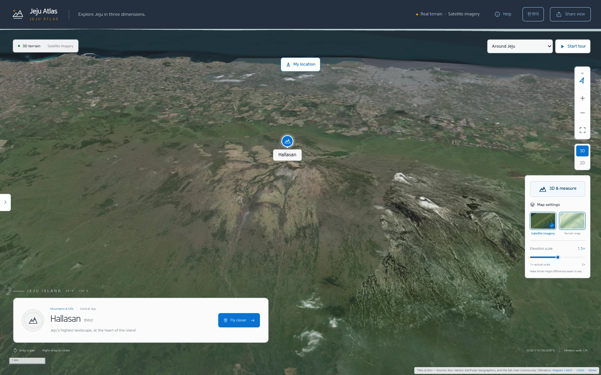
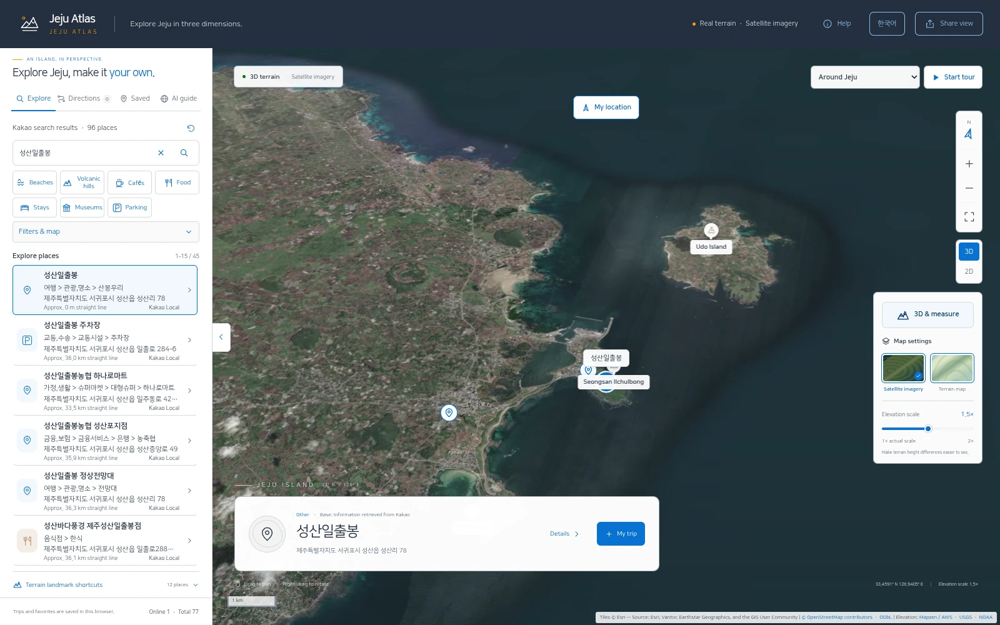
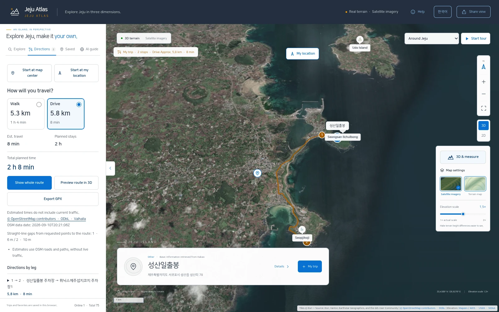
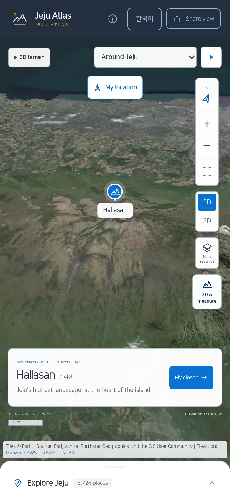
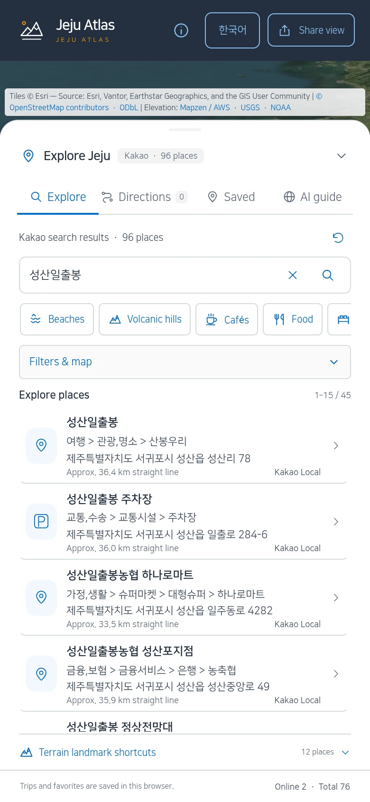
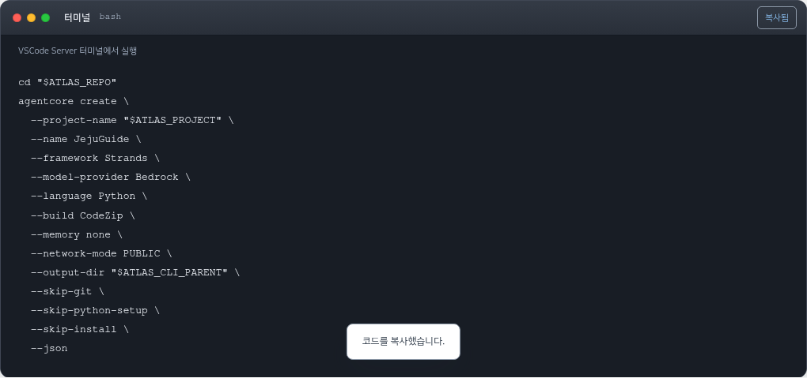
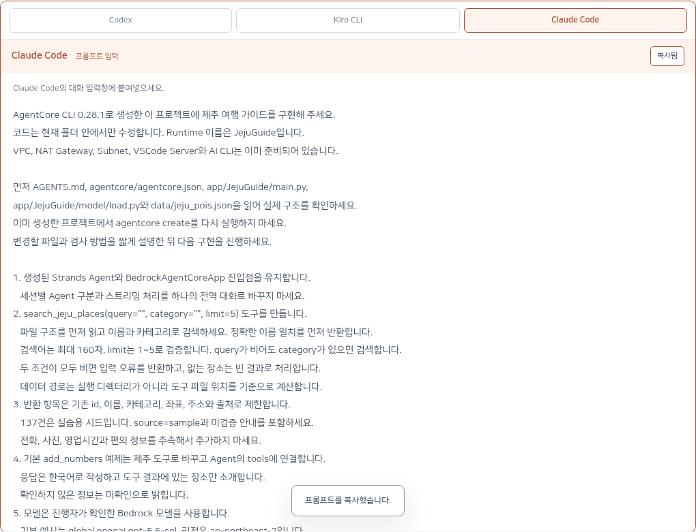

# Jeju Atlas

[](package.json)
[](docs/architecture.md)
[](agent/README.md)
[](workshop/README.md)

[한국어](README.md) | [English](README.en.md)

A web/PWA application for exploring Jeju terrain, finding places, planning trips and asking an AI travel guide.
MapLibre renders the map, Kakao Local supplies place searches, and Valhalla computes walking and driving routes.

[Live application](https://jeju-atlas.whchoi.net/) | [Workshop](https://jeju-atlas.whchoi.net/workshop/) | [Documentation](docs/README.md) | [Changelog](CHANGELOG.md)



*Application screenshots captured from the live English UI on September 13, 2026.*

## Overview

The frontend uses TypeScript and Vite. A Node.js API runs behind CloudFront, WAF and a public ALB on private ARM64 ECS Fargate tasks.
The deployment reuses its existing VPC and NAT gateways. A dedicated AgentCore Guide runs Strands and connects to its own Tools, Gateway and Memory.

The last verified deployment is `release-20260912T153512Z`, task definition `jeju-3d:26`.
Two healthy tasks and 99 operational checks were recorded on September 12, 2026.
These are release observations, not a live status indicator. See the [deployment record](workshop/DEPLOYMENT.md).

## Features

- Real elevation and satellite imagery, 2D/3D views, terrain controls and distance measurement.
- Place search by name, category and selected map area, with map/list highlighting.
- Favorites, recent searches and viewed places, and five pinned shortcuts.
- Start/finish search, waypoints, dwell times, itinerary reversal and GPX export.
- Actual Valhalla walking/driving route geometry, distances and estimates.
- Korean/English AI responses, streamed Markdown, tool progress and suggested follow-up questions.
- Available official photos and visitor facts with source and observation dates.
- PWA installation and offline access to the app shell and saved trips; the workshop has its own cache and update lifecycle.
- Current and cumulative browser-session counts.

The initial map displays representative terrain landmarks. Kakao search returns 15 places per page and at most 45 accessible results per query.

## Screenshots

### Place search

Search results for Seongsan Ilchulbong appear alongside the selected place on the map.



### Walking and driving routes

Compare walking and driving distances and estimates for the same endpoints, with the actual road route displayed on the map.



### Mobile

The 390px-wide mobile view shows the 3D map and an expanded place-search panel.

| 3D map | Place search |
| :---: | :---: |
|  |  |

## Architecture

```text
Browser/PWA -> CloudFront + WAF -> Lambda@Edge -> Public ALB -> Private Fargate
                                                               |-- Valhalla
                                                               |-- S3 / SQLite / DynamoDB
                                                               |-- Kakao Local
                                                               `-- AgentCore Guide (Strands)
                                                                     |-- Bedrock Global CRIS
                                                                     |-- Gateway / Tools
                                                                     `-- Memory
```

CloudFront also serves private static/media S3 origins through OAC and caches terrain tiles.
The browser loads Esri imagery. The ALB checks CloudFront origin-facing network access and an origin verification header.
Fargate has no public IP. AgentCore uses managed PUBLIC networking with IAM authentication.
See [architecture and boundaries](docs/architecture.md).

## Quick start

Use Node 24.18.1 or newer in the Node 24 line, npm and Python. Python 3.10+ is recommended for helpers; workshop Runtime code uses Python 3.14.

```bash
git clone https://github.com/whchoi98/jeju-atlas.git
cd jeju-atlas
npm ci
mkdir -p .local
python3 workshop/scripts/catalog_seed.py --output .local/catalog-standalone.sqlite
npm run build

HOST=127.0.0.1 PORT=8097 NODE_ENV=development \
PUBLIC_ORIGIN=http://localhost:8097 \
CATALOG_LOCAL_PATH="$PWD/.local/catalog-standalone.sqlite" \
node server/server.mjs
```

Open `http://localhost:8097`. Forward the port when using a remote EC2 host.
This starts with 137 committed sample records. The generator refuses to overwrite an existing catalog.
AI, Kakao lookup and road routing require their corresponding backend resources and configuration.
Production catalogs, enrichment responses and routing graphs are not stored in Git.

For Vite development, copy `.env.example` to `.env`, run `node --env-file=.env server/server.mjs` in one terminal and `npm run dev` in another.
The example origin is `http://localhost:5173`.
See [local development](docs/onboarding.md) for the Python check environment, port configuration and catalog verification.

## 120-minute AgentCore CLI workshop

Start on an EC2 VSCode Server with the supplied VPC, NAT gateways and subnets.
Use one available coding assistant: Codex, Kiro CLI or Claude Code.
Implement a Jeju search tool and use AgentCore CLI to create, run, deploy and invoke the agent.
The facilitator checks AgentCore CLI 0.28.1, dependencies, CDK bootstrap, deployment permissions and model access beforehand.

The participant EC2 needs the full Git source; the handbook ZIP has no executable
scripts or source dataset. Chapter 01 uses `core.py prepare` to create a participant
`activate.sh`, then `core.py doctor` to check Node 24, Python 3.14, the selected
assistant and core dependencies. Missing tools go under `workshop/.local/toolchain/`,
preserving system tools and Claude authentication. Source the activation file in
each new Bash terminal before opening the assistant in the participant project.
The workshop Runtime uses Sonnet 4.6, and Claude Code launches with
`claude --model claude-sonnet-4-6`. A separate explicit model check records real
results; the deployment region and organizer-verified Bedrock caller region are
configured independently.
The advanced workshop uses the participant App stack's default CloudFront HTTPS
URL for the app and handbook. ACM issuance, DNS configuration and custom-domain
registration are not workshop prerequisites.

| Track | Scope |
|---|---|
| Core | Chapters 00-04, 110 minutes |
| Buffer | 10 minutes |
| Optional | Chapters 05-13, complete Atlas infrastructure and operations |
| Deliverable | A participant-owned Runtime using a real model and a local place-search tool |
| Reader | Markdown, HTML, downloadable ZIP and offline PWA |

The duration is a course plan, not evidence of a completed 120-minute cloud rehearsal.
The CLI Runtime and the optional Atlas Guide/Tools/Gateway/Memory stack have separate lifecycles.



Mac-style terminal windows contain shell commands. Separate Codex, Kiro CLI and Claude Code panels contain prompts to paste into the selected assistant.



[Course](workshop/README.md) | [Facilitator](workshop/reference/facilitator.md) | [Downloads](workshop/reference/offline-start.md)

## Configuration

| Setting | Purpose |
|---|---|
| `CATALOG_LOCAL_PATH` / `CATALOG_BUCKET` | Local SQLite or an owned S3 catalog |
| `DETAILS_BUCKET` | Official detail snapshot |
| `PUBLIC_ORIGIN` | The browser-facing application origin |
| `ROUTING_URL` | Local Valhalla endpoint |
| `ROUTING_DATA_UPDATED_AT` | Actual routing-data timestamp |
| `KAKAO_REST_API_KEY` | Server-only lookup key, injected from SSM in production |
| `GuideLimitsEnabled` | Application AI cap configuration |

Production deployers target the owner's account and Seoul region. For another account, use the namespaced workshop flow.
See [.env.example](.env.example) and the [deployment runbook](docs/runbooks/deploy.md).

## Data boundaries

The committed 137-place dataset is a workshop seed, not officially verified visitor information.
The 6,724-place production catalog is a separate snapshot and does not represent the entire Kakao catalog.
Official enrichment supports individual fields, not blanket verification of a place.
Live traffic, complete Kakao ratings/reviews and offline AI are not provided by this implementation.
See [data quality](docs/data-quality.md) and [official details](docs/official-details-olle.md).

## Project structure

| Directory | Responsibility |
|---|---|
| `src/`, `public/`, `shared/` | Map UI, assets and shared contracts |
| `server/` | Node.js API |
| `agent/guide/`, `agent/tools/` | Strands Guide and MCP Tools |
| `routing/` | Valhalla runtime |
| `infra/`, `scripts/` | CloudFormation, build, deploy and verification |
| `tests/`, `workshop/`, `docs/` | Tests, course material and documentation |

See [AGENTS.md](AGENTS.md) for repository guidance and the
[implementation index](docs/reference/INDEX.md) for code pointers and design records.

## Testing and contributing

```bash
npm run check
npm run workshop:check
# With Playwright and Chromium configured:
WORKSHOP_BROWSER_TEST=1 npm run workshop:check
```

Full checks also require boto3, requests and cfn-lint. Local checks do not perform cloud deployment or model calls.
Follow [CONTRIBUTING.md](CONTRIBUTING.md), update [CHANGELOG.md](CHANGELOG.md), and attach the checks actually performed.
Use [GitHub Issues](https://github.com/whchoi98/jeju-atlas/issues) for non-sensitive reports and [SECURITY.md](SECURITY.md) for security guidance.

## Licensing and provenance

No root code license file is currently declared. Data, photos, map imagery, fonts and emoji have separate attribution and usage conditions.
See [fonts](public/fonts/README.md), [emoji](public/emoji/README.md), and [agent provenance](agent/source-provenance.json).
