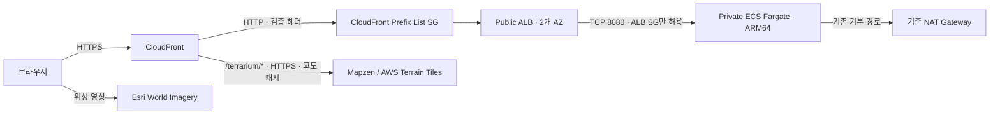

# 제주 아틀라스 · JEJU ATLAS

실제 제주 고도 데이터와 위성 영상을 겹쳐 보는 한국어 3D 지도입니다.

**배포 주소: [제주 아틀라스 열기](https://d2mznud99i2mdr.cloudfront.net)**

[AWS 배포 결과와 검증 기록](docs/deployment.md)

- 제주 전역과 한라산·성산일출봉·우도 등 12개 장소 탐색
- 이름·지역 검색, 산·오름/해안/섬 분류
- 2D/3D 전환, 위성/고도 지도 전환, 실제 높이 1×~2× 조절
- 장소로 이동, 제주 한 바퀴 자동 둘러보기, 현재 시점 공유
- 모바일 장소 서랍, 키보드 조작, reduced motion 지원

## 실행

Node.js 20.19 이상과 npm이 필요합니다.

```bash
npm ci
npm run dev
```

정적 빌드를 실제 배포 서버로 확인하려면:

```bash
npm run build
HOST=127.0.0.1 PORT=8097 node server/server.mjs
```

`http://127.0.0.1:8097`에서 엽니다. `/healthz`는 배포 버전이 포함된 JSON을 반환합니다.

## 배포 구조



서울 리전의 기존 `cc-on-bedrock-vpc`를 사용합니다. Public ALB는 AWS 관리 CloudFront 원본 Prefix List만 수신하며, 일치하는 원본 검증 헤더가 없는 요청은 403으로 거절합니다. Fargate는 Private 서브넷에 배치하고 Public IP를 할당하지 않습니다.

새 VPC·서브넷·NAT Gateway·라우트 테이블·공유 보안 그룹·DNS 레코드를 만들거나 변경하지 않습니다. 기존 ECR/CloudWatch VPC Endpoint도 사용 가능합니다.

| 항목 | 구성 |
|---|---|
| Registry 스택 | `Jeju3dRegistry` |
| 앱 스택 | `Jeju3dApp` |
| ECR / ECS 클러스터 / 서비스 | `jeju-3d` |
| Fargate | Linux ARM64, 0.25 vCPU, 512 MiB, 기본 태스크 1개 |
| 컨테이너 | UID/GID 1000, 읽기 전용 루트 파일시스템, Linux capabilities 제거 |
| 앱 IAM 역할 | AWS API 권한 없음 |
| 실행 IAM 역할 | 전용 ECR 읽기 및 로그 쓰기 |
| 배포 이미지 | SHA-256 digest 고정, 불변 ECR 태그 |
| 로그 | `/ecs/jeju-3d`, 14일 보관 |
| 실패 처리 | ECS deployment circuit breaker / rollback |

사용자→CloudFront는 HTTPS이며 HTTP는 HTTPS로 리다이렉트합니다. **CloudFront→ALB는 HTTP**입니다. 현재 계정의 Hosted Zone과 실제 공개 DNS 위임이 일치하지 않아 기본 CloudFront 주소를 사용합니다. 원본 구간까지 TLS를 적용하려면 공개 검증이 가능한 도메인과 서울 리전 ACM 인증서로 ALB HTTPS 리스너와 CloudFront origin policy를 함께 변경해야 합니다.

## 이미지 보안

프런트엔드는 Node 22 빌드 단계에서 컴파일합니다. 최종 컨테이너는 Alpine 3.24와 배포판의 Node 24 패키지를 사용하며 npm·yarn·컴파일러·개발 헤더를 포함하지 않습니다.

Alpine Node는 OpenSSL 공유 라이브러리를 사용합니다. Dockerfile은 `libssl3`/`libcrypto3`를 보안 수정 버전 `3.5.8-r0` 이상으로 업데이트합니다. 기본 이미지 digest와 Node 패키지 버전도 고정하며, 빌드한 최종 이미지를 ECR Inspector로 검사합니다.

## 최초 배포와 재배포

현재 스크립트는 계정 `061525506239` 및 `ap-northeast-2`로 범위를 고정합니다. 다른 계정에 실수로 배포하는 것을 막기 위한 검사입니다.

로컬 요구 사항: AWS 역할/자격 증명, Docker ARM64 빌드, Python 3.9 이상 및 boto3/requests, `cfn-lint`. Python은 유지보수 중인 3.10 이상을 권장합니다.

```bash
python3 scripts/deploy.py network
python3 scripts/deploy.py plan-bootstrap
```

`.local/bootstrap-change-set.json`에서 전용 ECR 저장소 생성 내용을 검토한 다음:

```bash
python3 scripts/deploy.py apply-bootstrap
python3 scripts/deploy.py status-bootstrap
```

Registry 스택이 `CREATE_COMPLETE`가 되면:

```bash
python3 scripts/deploy.py build-push
python3 scripts/deploy.py plan-app
```

`.local/app-change-set.json`에서 앱 변경 내용을 검토한 다음:

```bash
python3 scripts/deploy.py apply-app
python3 scripts/deploy.py status-app
```

`CREATE_COMPLETE` 또는 `UPDATE_COMPLETE`와 CloudFront 배포 완료를 확인합니다.

```bash
python3 scripts/verify.py
```

기존 앱을 재배포할 때는 `build-push` → `plan-app` → 변경 내용 검토 → `apply-app` → `status-app` → `verify.py` 순서로 실행합니다. 필요한 경우 다음 명령으로 HTML 캐시만 무효화합니다.

```bash
python3 scripts/deploy.py invalidate
```

`dist/assets`의 파일명은 콘텐츠 hash를 포함합니다. HTML은 재검증하고, hash가 붙은 JS/CSS/worker는 장기 캐시합니다. 지도 뷰의 상태는 URL fragment에 저장하여 공유하며 CloudFront cache key에는 포함되지 않습니다.

원본 검증 값은 Secrets Manager에서 생성합니다. 스크립트·이미지·출력 파일에 값을 저장하지 않습니다. ECR 로그인 정보는 별도 임시 Docker 설정에만 전달하고 이미지 푸시 후 삭제합니다.

원본 검증 값을 교체할 때는 CloudFront origin header와 ALB listener rule도 함께 업데이트해야 합니다. Secrets Manager의 값 변경만으로 이미 적용된 CloudFormation 동적 참조가 자동 갱신되지는 않습니다.

## 고도 타일 캐시

운영 앱의 고도 타일은 같은 CloudFront 도메인의 `/terrarium/{z}/{x}/{y}.png`에서 받습니다. 별도 캐시 동작이 공개 Mapzen S3 원본에 HTTPS로 연결하므로 고도 요청은 ALB/Fargate를 거치지 않습니다. ALB 원본 검증 헤더는 고도 원본에 전달하지 않습니다.

- 엣지 캐시 기본 TTL: **7일**, 최소 0초, 최대 30일. 원본이 캐시 헤더를 제공하면 캐시 정책 범위 안에서 반영합니다.
- 정상 PNG 및 304 응답의 브라우저 캐시: **1일**.
- 오류 응답: **`Cache-Control: no-store`**, 기존 CloudFront 오류 캐시 TTL 0초.
- CloudFront Functions가 정상 응답의 브라우저 TTL을 설정합니다. 오류에는 함수가 실행되지 않을 수 있어 응답 헤더 정책의 기본값부터 `no-store`로 둡니다.
- 캐시 키에 쿠키·쿼리·사용자별 헤더를 포함하지 않습니다.
- 원본과 같은 PNG 바이트를 제공하며 지형 해상도와 고도 값은 변경하지 않습니다.

로컬 Vite 개발 및 `localhost`/`127.0.0.1` 정적 미리보기는 공개 S3에 직접 연결합니다. 운영 주소에서 실행하는 브라우저 검사는 고도 요청이 CloudFront 도메인을 사용하는지 별도로 확인합니다. 위성 영상은 기존 Esri 서비스에서 받습니다.

서울 S3에 데이터를 복제하지 않고 기존 공개 데이터셋을 캐시합니다. 추가 고정 서버 비용은 없으며, 고도 타일의 CloudFront 전송·HTTPS 요청과 응답 함수 실행량에 따라 비용이 늘어납니다. 검증 호스트의 캐시 적중 지연 측정은 실제 사용자 FPS나 전체 페이지 로딩 시간 측정과 구분합니다.

## 검증

```bash
node --test tests/*.test.mjs
python3 -m unittest discover -s tests -p '*_test.py'
npm run build
cfn-lint infra/bootstrap.yaml infra/application.yaml
python3 scripts/verify-terrain-cache.py --rounds 3
```

실제 Chromium 검증은 별도 Playwright 설치와 WebGL2 가능한 브라우저를 사용합니다.

```bash
PLAYWRIGHT_MODULE=/absolute/path/to/playwright/index.mjs \
CHROME_EXECUTABLE=/absolute/path/to/chrome \
node scripts/browser-check.mjs http://127.0.0.1:8097 browser-local
```

브라우저 검사는 실제 고도·위성 타일, 지도 시점, 검색, 분류, 2D/3D, 고도 배율, 지형 지도, 자동 둘러보기, 공유 복원, 모바일 조작을 확인합니다. 결과와 스크린샷은 `.local/`에 저장합니다.

운영 검증 `scripts/verify.py`는 HTTPS, HTTP 리다이렉트, CloudFront 캐시, ALB Target Health, ECS 안정화, Private ENI, Prefix List/SG, 원본 헤더 일치, 기존 NAT 경로를 실제 AWS API 및 HTTP로 확인합니다. 헤더 값 자체는 출력하지 않습니다.

`verify-terrain-cache.py`는 제주 샘플 5개의 원본/CloudFront PNG 해시, 브라우저 TTL, CORS, 캐시 적중, 다운로드 지연, 없는 타일의 오류 캐시 금지를 확인합니다. 결과는 `.local/terrain-cache-verification.json`에 저장합니다.

## 비용과 운영 범위

730시간/월, 기본 태스크 1개, 서울 리전 On-Demand 단가 기준:

| 항목 | 월 기준 |
|---|---:|
| Fargate 0.25 vCPU / 0.5 GiB ARM64 | 약 $8.29 |
| ALB 시간당 비용 | 약 $16.43 |
| ALB 공인 IPv4 최소 2개 | 약 $7.30 |
| 고정성 비용 합계 | 약 $32.02 |

ALB LCU, CloudFront 요청·전송, ECR, 로그, Secrets Manager, NAT 추가 데이터 처리량은 별도입니다. 소규모 사용은 **월 $35–45 정도**로 예상하며 실제 사용량·세금·할인·크레딧에 따라 달라집니다. 기존 NAT Gateway의 시간당 비용을 새로 추가하지 않습니다.

고도 캐시 도입 후 타일 전송도 이 계정의 CloudFront 사용량에 포함됩니다. 2026-09-09 AWS Price List API 기준 아시아 태평양 그룹의 첫 10TB 구간은 $0.12/GB, HTTPS 요청은 $1.20/100만 건, CloudFront Functions는 무료 구간 초과 시 $0.10/100만 실행입니다. 예를 들어 **추가 100GB + HTTPS 100만 건 + 함수 100만 실행은 약 $13.30**이며, 무료 구간·할인·세금은 미반영입니다.

태스크 1개를 사용하는 기본 구성입니다. 배포 시 일시적으로 2개 태스크가 실행될 수 있습니다. 상시 다중 태스크 이중화는 구성하지 않았습니다. CloudWatch 앱 로그는 활성화하지만 비용을 고려해 CloudFront/ALB 요청 로그와 별도 KMS 키는 만들지 않습니다.

인프라 보안 검사에서 오류는 없어야 합니다. 기본 CloudFront 인증서/TLS 정책, HTTP origin, 요청 로그 비활성화, AWS 기본 암호화, 전용 리소스 이름, ECR 인증의 필수 wildcard, HTTPS outbound에 관한 cfn-nag 경고는 이 구성의 의도된 범위입니다.

## 데이터 출처와 한계

- 지도 엔진: [MapLibre GL JS](https://maplibre.org/maplibre-gl-js/docs/)
- 고도: [Mapzen / AWS Terrain Tiles](https://registry.opendata.aws/terrain-tiles/)
- 고도 데이터 원저작자: [Tilezen attribution](https://github.com/tilezen/joerd/blob/master/docs/attribution.md)
- 위성 영상: [Esri World Imagery](https://services.arcgisonline.com/ArcGIS/rest/services/World_Imagery/MapServer)
- 장소 정보 참고: [Visit Jeju](https://www.visitjeju.net/)

고도 타일은 CloudFront를 통해 공개 S3 원본에서 받고, 위성 타일은 브라우저가 Esri에 직접 요청합니다. 운영용 S3 복제본이나 대량 다운로드 데이터셋은 만들지 않았습니다. 외부 데이터 서비스와 인터넷 연결이 필요합니다. 영상은 실시간 촬영 영상이 아니며, 지역별 촬영 시점과 해상도가 다릅니다. DEM 기반 지형으로 건물 사진측량, 개별 바위의 정밀 모델, 도보 내비게이션을 제공하지 않습니다.

제주 지역 고도에 쓰이는 전 지구 SRTM/GMTED2010 데이터는 USGS, ETOPO1은 NOAA에 출처를 표시합니다. 위성 영상에는 Esri 서비스 메타데이터의 현재 제공자 문구(Esri, Vantor, Earthstar Geographics 및 GIS User Community)를 표시합니다.

기본 고도 배율은 1.5×이며 화면에 표시됩니다. 설정의 `1× 실제 높이`를 선택하면 데이터의 실제 비율로 볼 수 있습니다. DEM 격자 해상도 때문에 정상의 표고와 지도에서 샘플링한 고도는 다를 수 있습니다.

## 파일 구성

```text
src/                    지도·장소·한국어 UI
public/                 정적 자산
server/server.mjs       의존성 없는 정적 HTTP 서버
tests/                  HTTP·배포 계획 회귀 검사
infra/                  CloudFormation 템플릿
scripts/                계획·배포·AWS 검증·브라우저 검증
docs/                   설계·구현 계획·배포 결과
.local/                 생성된 결과·검증 자료 (Git 제외)
```

## 정리

서비스가 더 이상 필요하지 않을 때 앱 스택을 삭제하면 CloudFront, ALB, ECS 및 앱 전용 보안 그룹이 정리됩니다. CloudFront 비활성화·삭제는 시간이 걸릴 수 있습니다. ECR 저장소와 CloudWatch 로그 그룹은 실수로 삭제하지 않도록 `Retain`으로 설정되어 있으므로 별도 보관 여부를 결정해야 합니다. 기존 VPC·서브넷·NAT는 이 앱 스택의 소유 리소스가 아닙니다.
