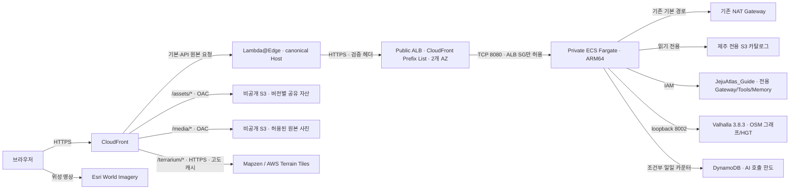

# 제주 아틀라스 · JEJU ATLAS

실제 제주 고도·위성 지도와 운영 장소 카탈로그, 여행 코스, AI 가이드를 연결한 한·영 앱입니다.

이 프로젝트의 작업 디렉터리는 **`/home/ec2-user/my-project/jeju-atlas`**이며,
최신 지도·이동 경로·전용 Agent 작업과 Git 이력을 독립 저장소의 **`main`**에 모았습니다.
[저장소 구성·GitHub 업로드](docs/repository.md) · [분리 구성·기존 영향 점검](docs/separation-audit-2026-09-11.md)

[AgentCore CLI · Codex/Kiro CLI/Claude Code 워크숍](workshop/README.md) — 14개 챕터, EC2 계정·VPC 기반 독립 실습,
실제 Atlas AgentCore·Fargate·데이터·엣지·운영 구성과 정리 절차를 제공합니다.

**배포 주소: [제주 아틀라스 열기](https://jeju-atlas.whchoi.net)** · 기존 CloudFront 주소도 지원합니다.

[이동 경로·3D·전용 Agent 전환 현황](docs/mobility-independence-2026-09-11.md) · [이전 공개 배포 기록](docs/deployment.md)

**휴대폰 장소 목록을 넓게 스크롤하도록 개선하고, 사이드바 경계에 작은 접기·펼치기 화살표를 배치했습니다.**
현재 릴리스는 `release-20260912T022131Z` / `jeju-3d:17`입니다.
`Jeju3dApp` `UPDATE_COMPLETE`, PRIMARY `COMPLETED`, desired/running 2/2와 웹·라우터 HEALTHY를 확인했습니다.
운영 사이트에서 휴대폰 해변 목록·터치 스크롤·페이지 전환, 경계 화살표와 사이드바 상태 복원을 확인했습니다.
이전 릴리스의 카카오 이름·분류 매칭 보완과 실패 사유 안내도 포함합니다.
운영 검사 94개, 앱 Node 447개·Python 193개가 통과했습니다.
앱 선택 검사 3개는 건너뛰었고, 이번 화면 검증에서 AI 모델과 카카오 API는 호출하지 않았습니다.
[모바일 목록·경계 화살표 최신 배포 기록](docs/mobile-sidebar-release-2026-09-12.md) ·
[카카오 연결 보완](docs/kakao-matching-release-2026-09-12.md) ·
[최초 카카오·사이드바 배포](docs/kakao-sidebar-release-2026-09-11.md) ·
[워크숍 열기](https://jeju-atlas.whchoi.net/workshop/) · [PWA 배포 기록](docs/pwa-workshop-release-2026-09-11.md)

전용 Agent·카탈로그·도보/차량 경로 엔진 전환과 실제 AI 답변 완료 검증은
[이전 릴리스 기록](docs/mobility-independence-2026-09-11.md)에 있습니다.
CloudFront→ALB HTTPS는 2026-09-10 19:38 UTC부터 배포된 상태이며 원본 DNS 전환 대기는 없습니다.
위 내용은 해당 릴리스의 검증 기록입니다. 이후 분리 점검에서 기존 프로젝트 역할의
제주 로그 조회 권한과 기존 Runtime 로그의 14일 보관 정책 잔존을 확인했습니다.
실행 리소스 분리와 권한 경계·과거 변경 이력은 [점검 결과](docs/separation-audit-2026-09-11.md)에서 구분합니다.

[AgentCore·Strands 구성](docs/agentcore-components.md) · [공식 상세·갤러리·올레길](docs/official-details-olle.md) ·
[방문 정보 부족과 카카오 연동 검토](docs/visitor-info-kakao-2026-09-11.md)

과거 릴리스 기록: [초기 운영 보강·한영 UI](docs/commercial-release-2026-09-10.md) · [공식 상세·올레길](docs/details-olle-release-2026-09-10.md)

- 제주 전역과 한라산·성산일출봉·우도 등 12개 지형 바로가기
- 운영 S3 카탈로그의 6,724곳 검색·분류·주변 탐색과 GPU 클러스터
- 기본 정보와 보강 정보를 구분한 장소 상세, 사진·요일별 이용시간·편의·인허가 상태·출처
- 2D/3D 전환, 위성/고도 지도 전환, 실제 높이 1×~2× 조절
- 장소로 이동, 제주 한 바퀴·올레길 코스별 3D 둘러보기, 현재 시점 공유
- 즐겨찾기, 코스 순서·체류시간 편집, 실제 이동 경로 표시, 브라우저 저장과 코스 공유
- Open-Meteo 날씨·3일 예보와 한영 AI 가이드
- 설치형 PWA, 저장한 코스 오프라인 확인, 모바일·키보드·reduced motion 지원
- 한국어/English 토글, 선택 기억, 화면·추천 질문·AI 답변 언어 연동
- 저장 자료 백업·검토 후 복원·기기 삭제, 저장 실패와 탭 간 편집 충돌 보호
- 사이드바 경계의 화살표로 접기·펼치기, AI 탭 확대와 대화·입력 상태 보존
- 휴대폰 탐색 패널의 목록 스크롤·페이지 전환과 펼쳐 쓰는 추가 필터
- 카카오 Local의 주소·전화·상세 링크를 기존 장소 정보와 구분해 실시간 조회

이번 릴리스에 반영한 기능입니다. 실제 네이티브 통합과 공개 브라우저 검사가 각각 8/8 통과했습니다.

- 최대 12곳의 실제 도보·차량 경로 거리/예상 시간 비교, 체류 포함 계획 시간·구간 안내
- 출발·도착 지정, 지도 중심·명시적으로 허용한 현재 위치, GPX·이동 수단을 포함한 코스 공유
- 명소 12곳의 전용 3D 탐색·회전·위에서 보기, 실제 경로 미리보기·고도 단면
- 여러 점 직선 거리 재기·마지막 점 취소·초기화
- 자체 소스·S3 아티팩트·카탈로그·Runtime·Gateway·Memory를 사용하는 전용 AI

## 실행

Node.js **24.18.1 이상**, npm과 Python 3가 필요합니다. Python은 공개 워크숍 ZIP을 만드는 빌드 단계에서만 사용합니다.
서버는 Node의 SQLite 기능을 사용합니다.
전체 검사에는 Node 24 계열을 사용하며 `.nvmrc`에 검증 버전을 기록했습니다.

```bash
cd /home/ec2-user/my-project/jeju-atlas
npm ci
npm run build
npm run dev
```

API 서버를 별도 터미널에서 실행하면 Vite가 `/api`를 로컬 8097 포트로 전달합니다.
로컬 카탈로그를 준비한 환경에서는 `.env.example`을 `.env`로 복사하여 사용할 수 있습니다.
카탈로그·키·실행 기록은 Git에 포함하지 않습니다.

```bash
cp .env.example .env
# .env의 CATALOG_LOCAL_PATH를 준비한 SQLite 파일 경로로 설정
node --env-file=.env server/server.mjs
```

소유 S3 버킷을 사용하는 경우의 설정 예입니다.

```bash
CATALOG_BUCKET=jeju-3d-data-061525506239-ap-northeast-2 \
DETAILS_BUCKET=jeju-3d-data-061525506239-ap-northeast-2 \
AWS_REGION=ap-northeast-2 \
HOST=127.0.0.1 PORT=8097 NODE_ENV=development \
PUBLIC_ORIGIN=http://localhost:5173 \
node server/server.mjs
```

해당 S3 객체를 읽을 수 있는 AWS 역할이 필요합니다. 읽기 전용 로컬 카탈로그 파일이 있으면 `CATALOG_BUCKET` 대신 `CATALOG_LOCAL_PATH=/absolute/path/catalog.sqlite`를 지정할 수 있습니다. 로컬 AI는 런타임·사용량 테이블·세션 키를 명시적으로 구성한 경우에만 켜집니다.

실제 Valhalla를 같은 네트워크의 loopback에 준비한 경우
`ROUTING_URL=http://127.0.0.1:8002`, `ROUTING_DATA_UPDATED_AT=2026-09-10T20:21:06Z`를
추가합니다. 준비·데이터 경로는 [라우터 설명](routing/README.md)을 따릅니다.
원본 참조 저장소나 공개 데모 라우팅 서버는 실행 의존성이 아닙니다.

정적 빌드를 실제 배포 서버로 확인하려면:

```bash
npm run build
HOST=127.0.0.1 PORT=8097 \
CATALOG_LOCAL_PATH=/absolute/path/catalog.sqlite \
PUBLIC_ORIGIN=http://127.0.0.1:8097 \
node server/server.mjs
```

`http://127.0.0.1:8097`에서 엽니다. `/healthz`는 배포 버전이 포함된 JSON을 반환합니다.

## 현재 공개 배포 구조

공개 task 12는 전용 Guide·카탈로그·라우터를 사용합니다.
이전 task 11의 공유 Agent 연결은 [과거 배포 기록](docs/deployment.md)에 보존합니다.



서울 리전의 기존 `cc-on-bedrock-vpc`를 사용합니다. Public ALB는 AWS 관리 CloudFront 원본 Prefix List만 수신하며, 일치하는 원본 검증 헤더가 없는 요청은 403으로 거절합니다. Fargate는 Private 서브넷에 배치하고 Public IP를 할당하지 않습니다.

기존 VPC·서브넷·NAT Gateway·라우트 테이블을 재사용하며 공유 네트워크를 변경하지 않습니다. 기존 ECR/CloudWatch VPC Endpoint도 사용 가능합니다.

| 항목 | 구성 |
|---|---|
| Registry 스택 | `Jeju3dRegistry` |
| 앱 스택 | `Jeju3dApp` |
| 원본 TLS / 공유 자산 스택 | `Jeju3dOriginRouting`(us-east-1) / `Jeju3dStatic`(서울) |
| 전용 AgentCore 스택 | `Jeju3dAgentCore` — 생성 완료, Guide·Tools 버전 1 READY |
| ECR / ECS 클러스터 / 서비스 | `jeju-3d` |
| Fargate | task 12: 0.5 vCPU·1,024 MiB, 라우터 상한 512 MiB. 정상 2개, 최소 2개·최대 4개 |
| 데이터 수집 | `jeju-3d-data:4`; 소유 카탈로그 사용, `Jeju3dData` `UPDATE_COMPLETE` |
| 컨테이너 | UID/GID 1000, 읽기 전용 루트 파일시스템, Linux capabilities 제거 |
| 앱 IAM 역할 | 지정 카탈로그·공식 상세·올레길 S3 객체 읽기, 지정 AI 런타임 호출, 전용 할당량 테이블 GetItem·UpdateItem |
| 실행 IAM 역할 | 전용 ECR·로그 및 세션 서명 키 주입 |
| 파일시스템 | 루트 읽기 전용, `/tmp` 볼륨만 카탈로그 갱신용 쓰기 허용 |
| 배포 이미지 | SHA-256 digest 고정, 불변 ECR 태그 |
| 로그 | 앱·CloudFront 허용 필드·Agent/Tools Runtime 로그 14일 보관 |
| 실패 처리 | ECS deployment circuit breaker / rollback |

사용자→CloudFront와 CloudFront→ALB는 HTTPS입니다. `OriginTlsEnabled=true`,
`OriginTlsMode=canonical-host`를 사용합니다. us-east-1의
`jeju-3d-origin-host:1`이 기본 동작과 `/api/catalog/*`, `/api/*`의 원본 요청에서만
Host를 인증서 이름 `jeju-atlas.whchoi.net`으로 고정합니다. 연결 대상은 ALB DNS이며
별도 원본 CNAME이 필요하지 않습니다. 본문은 함수에 전달하지 않습니다.
`/assets/*`, `/media/*`, `/terrarium/*`에는 이 함수를 연결하지 않습니다.

[운영 보강 기준](docs/superpowers/specs/2026-09-10-commercial-readiness.md) · [참고 프로젝트 검토](docs/reference-review.md) · [알람·로그](docs/operations.md) · [용량·비용](docs/capacity-cost.md) · [부하·복구 검사](docs/load-recovery.md)

## 이미지 보안

빌드와 최종 컨테이너는 Alpine 3.24와 배포판의 Node 24 패키지를 사용합니다. 최종 이미지에는 서버에 필요한 AWS SDK만 남기며 npm·yarn·컴파일러·개발 헤더는 포함하지 않습니다.

Alpine Node는 OpenSSL 공유 라이브러리를 사용합니다. Dockerfile은 `libssl3`/`libcrypto3`를 보안 수정 버전 `3.5.8-r0` 이상으로 업데이트합니다. 기본 이미지 digest와 Node 패키지 버전도 고정하며, 빌드한 최종 이미지를 ECR Inspector로 검사합니다.

## 최초 배포와 재배포

현재 스크립트는 계정 `061525506239` 및 `ap-northeast-2`로 범위를 고정합니다. 다른 계정에 실수로 배포하는 것을 막기 위한 검사입니다.

로컬 요구 사항: AWS 역할/자격 증명, Docker ARM64 빌드, Python 3.9 이상 및 boto3/requests, `cfn-lint`. Python은 유지보수 중인 3.10 이상을 권장합니다.

```bash
python3 scripts/deploy.py network
python3 scripts/deploy.py plan-bootstrap
```

`.local/bootstrap-change-set.json`에서 전용 ECR 저장소 생성 내용을 검토한 다음:

```bash
python3 scripts/deploy.py apply-bootstrap
python3 scripts/deploy.py status-bootstrap
```

Registry 스택이 `CREATE_COMPLETE`가 되면:

```bash
python3 scripts/deploy.py build-push
python3 scripts/deploy.py plan-app
```

`.local/app-change-set.json`에서 앱 변경 내용을 검토한 다음:

```bash
python3 scripts/deploy.py apply-app
python3 scripts/deploy.py status-app
```

`CREATE_COMPLETE` 또는 `UPDATE_COMPLETE`와 CloudFront 배포 완료를 확인합니다.

```bash
python3 scripts/verify.py
```

기존 앱을 재배포할 때는 `build-push` → `plan-app` → 변경 내용 검토 → `apply-app` → `status-app` → `verify.py` 순서로 실행합니다.
`invalidate`는 앱 HTML·서비스워커·설치 메타데이터·아이콘과 `/workshop*` 캐시를 갱신합니다.
해시가 포함된 `/assets/*`와 기존 지도 타일은 그대로 유지합니다.

이번 전환은 [라우터 이미지](routing/README.md)를 먼저 준비하고 웹 이미지와 digest 쌍으로
기록합니다. 앱 계획은 전용 Guide·전용 카탈로그 출력을 소비합니다.
독립 Guide 배포는 `scripts/deploy-atlas-agent.py`의
`build` → `publish` → `plan` → 검토 → `apply` → `status` → `configure-logs` 순서입니다.
기존 `scripts/deploy-guide-models.py` CLI는 폐기됐으며 AWS 연결 전에 종료합니다.
[전용 Agent 절차](agent/README.md)

`infra/production.json`에 사용자 도메인·인증서·용량·AI 한도와 전환 설정을 관리합니다.
`build-push`는 Node·Python 테스트, 전체 템플릿 검사, npm 취약점 검사와 빌드를 먼저
실행합니다. `/readyz`를 지원하지 않는 기존 이미지에서 넘어올 때는 `/healthz`로
이미지를 먼저 교체하고, 서비스 안정화 후 `TargetHealthPath`를 `/readyz`로 바꿉니다.
자동 확장 중인 실제 태스크 수를 배포 때 최소값으로 낮추지 않습니다.

```bash
python3 scripts/deploy.py invalidate
```

`/assets/*`는 비공개 버킷 `jeju-3d-assets-061525506239-ap-northeast-2`의 공유 자산으로
연결하며 OAC `E2W270OBXMQ1S2`로 서명합니다. `build-push`는 해당 스택이 있으면
정확한 이미지 digest에서 자산을 추출·게시하고, `plan-app`은 이미지 매니페스트를 확인합니다.
기존 자산을 덮어쓰거나 삭제하지 않아 롤링 배포 중 이전 HTML의 참조를 유지합니다.
2026-09-10에는 당시 이미지 **3개에 필요한 19개 자산의 HTTP 200·SHA-256 일치**,
직접 S3 접근 차단·매니페스트 비공개를 검증했습니다.
[당시 운영 기록](docs/commercial-completion-audit-2026-09-10.md). 이번 이미지의 자산·화면 결과는 공개 브라우저 최종 검사에 별도로 기록합니다.

HTML은 재검증하고 hash가 붙은 JS/CSS/worker는 1년 immutable 캐시합니다.
지도 상태는 URL fragment에 저장하며 CloudFront cache key에 포함하지 않습니다.
수동 롤백은 [승인 이미지 절차](docs/rollback.md)를 따릅니다. 이전 이미지로 되돌리는
수동 운영 롤백은 실행하지 않았습니다. 이번 전환의 실패 시도에서 발생한 CloudFormation
자동 롤백과 성공한 재시도는 [배포 이력](docs/mobility-independence-2026-09-11.md#실패-시도와-복구-이력)에 구분합니다.

원본 검증 값은 Secrets Manager에서 생성합니다. 스크립트·이미지·출력 파일에 값을 저장하지 않습니다. ECR 로그인 정보는 별도 임시 Docker 설정에만 전달하고 이미지 푸시 후 삭제합니다.

원본 검증 값을 교체할 때는 CloudFront origin header와 ALB listener rule도 함께 업데이트해야 합니다. Secrets Manager의 값 변경만으로 이미 적용된 CloudFormation 동적 참조가 자동 갱신되지는 않습니다.

## 고도 타일 캐시

운영 앱의 고도 타일은 같은 CloudFront 도메인의 `/terrarium/{z}/{x}/{y}.png`에서 받습니다. 별도 캐시 동작이 공개 Mapzen S3 원본에 HTTPS로 연결하므로 고도 요청은 ALB/Fargate를 거치지 않습니다. ALB 원본 검증 헤더는 고도 원본에 전달하지 않습니다.

- 엣지 캐시 기본 TTL: **7일**, 최소 0초, 최대 30일. 원본이 캐시 헤더를 제공하면 캐시 정책 범위 안에서 반영합니다.
- 정상 PNG 및 304 응답의 브라우저 캐시: **1일**.
- 오류 응답: **`Cache-Control: no-store`**, 기존 CloudFront 오류 캐시 TTL 0초.
- CloudFront Functions가 정상 응답의 브라우저 TTL을 설정합니다. 오류에는 함수가 실행되지 않을 수 있어 응답 헤더 정책의 기본값부터 `no-store`로 둡니다.
- 캐시 키에 쿠키·쿼리·사용자별 헤더를 포함하지 않습니다.
- 원본과 같은 PNG 바이트를 제공하며 지형 해상도와 고도 값은 변경하지 않습니다.

로컬 Vite 개발 및 `localhost`/`127.0.0.1` 정적 미리보기는 공개 S3에 직접 연결합니다. 운영 주소에서 실행하는 브라우저 검사는 고도 요청이 CloudFront 도메인을 사용하는지 별도로 확인합니다. 위성 영상은 기존 Esri 서비스에서 받습니다.

서울 S3에 데이터를 복제하지 않고 기존 공개 데이터셋을 캐시합니다. 추가 고정 서버 비용은 없으며, 고도 타일의 CloudFront 전송·HTTPS 요청과 응답 함수 실행량에 따라 비용이 늘어납니다. 검증 호스트의 캐시 적중 지연 측정은 실제 사용자 FPS나 전체 페이지 로딩 시간 측정과 구분합니다.

## 장소 카탈로그와 출처

전용 실행에 사용할 카탈로그를 아래 소유 버킷에 복사했고, 6,724곳과 원본 SHA-256을
그대로 유지했습니다. 공개 웹 task 12와 수집 작업 4도 이 소유 카탈로그를 사용합니다.

```text
s3://jeju-3d-data-061525506239-ap-northeast-2/catalog/catalog.sqlite
```

복사·해시 검증 (`.local/independence/catalog-import-applied.json`, 로컬 자료).
에이전트 소스는 검증된 커밋에서 한 번 읽기 전용으로 복사해 `agent/guide/`, `agent/tools/`에서
소유합니다. 후속 빌드·배포·실행은 참조 프로젝트 디렉터리나 공유 Runtime을 사용하지 않습니다.

확인 당시 6,724곳은 **OpenStreetMap 6,587곳 + 큐레이션 시드 137곳**입니다. 137곳의 장소 이름은 실제 장소를 바탕으로 하지만 기본 좌표·주소·소개는 공식 대조 검증값으로 취급하지 않습니다. 주간 보강으로 연결된 사진·요일별 시간·인허가 정보는 기본 필드와 출처를 나눠 보여 줍니다.

사진에는 credit/license를 표시하고 상업 이용이 가능한 허용 목록을 적용합니다. KOGL-2·KOGL-4·NC·불명확한 라이선스는 노출하지 않으며 KOGL-3 원본 URL을 유지하고 파생 썸네일을 만들지 않습니다. 없는 전화·시간·소개를 생성하지 않습니다. `business_status=open`은 **개별 인허가상의 상태**이며, 장소 전체의 운영 여부나 현재 시각의 영업을 확정하지 않습니다.

`field_evidence`로 기본 정보·편의·시간의 출처와 확인 수준을 구분합니다.
`tourapi_usetime`은 원문 시간의 파싱 결과로 표시하며 요일별 운영과 휴무일이
독립적으로 확인된 정보로 취급하지 않습니다. [데이터 품질 기록](docs/data-quality.md)

서버는 S3 ETag를 10분마다 확인합니다. 검증된 새 SQLite 파일로 교체하고, 원본 장애 시 마지막 정상 파일을 유지하면서 갱신 지연을 알립니다. 브라우저의 API 응답에는 출처와 데이터 기준일을 남깁니다.

첫 지도에는 대표 명소 아이콘만 표시합니다. 카테고리나 검색어를 선택하면 해당 카탈로그 장소를 지도에 표시하며, 전체 장소 표시는 사용자가 켤 수 있습니다. 해변·오름·카페 등은 서로 다른 아이콘을 사용하고, 대표 명소와 검색 결과는 카탈로그 상세 화면으로 연결됩니다.

## AI와 저장

전용 Guide `JejuAtlas_Guide-2sFw9YBI8V`, Tools `JejuAtlas_Tools-Nh0YFIFC7c`,
HTTP Gateway와 Memory가 배포됐고 공개 ECS task 12에 연결됐습니다.
브라우저는 AWS 자격 증명이나 런타임 ARN을 받지 않으며 서버가 IAM으로 호출합니다.
전용 Gateway 대상 경로는 `/JejuAtlasTools/invocations`입니다.

서울 Global CRIS의 **GPT-5.6 Sol**을 일반 질문에, **GPT-6 Astra**를 일정·코스
계획에 사용합니다. 한영 토글의 `locale`은 요청마다 고정되어 AgentCore까지
전달됩니다. 여러 태스크가 DynamoDB의 원자적 사용량·실행 잠금·요청 ID를
공유하며, 결과가 불명확한 요청을 자동으로 다시 과금 호출하지 않습니다.

전용 Guide의 실제 한국어 호출 **17.553초**, 영어 호출 **25.434초**와 정상 `done`을 확인했습니다.
검사 구간의 로그·트레이스 **8,260건**에서 입력 표식·질문·답변 유출은 검출되지 않았고,
모델·도구·토큰 메타데이터는 유지됐습니다. 공개 웹 전체 지연이나 미래 요청의 보장이 아닙니다.
서비스가 자동 생성한 전용 Runtime 로그 두 개에 `configure-logs`로 **14일 보관**을 적용했습니다.
같은 로그 그룹을 CloudFormation에 중복 선언하지 않습니다. Memory 이벤트의 30일 보관과는 별개입니다.
[개인정보 관측 검사와 보관 범위](docs/agentcore-components.md#관측-로그와-개인정보)

질문과 응답 처리는 초기 참조 검토를 반영한 이 프로젝트 소유 구현입니다. 유휴 14분이 지나 대화가 만료되면 같은 질문을 한 번 복구하며, 유효한 대화를 계속할 때는 서명 토큰을 갱신합니다. 이미 과금됐을 수 있는 스트리밍·네트워크 오류와 이용 한도는 자동 재전송하지 않습니다.

AI 응답은 강조·목록·표·코드·안전한 링크 등 GFM 마크다운으로 표시합니다. 준비 중 상태와 실제 사용 도구를 보여주고, 하단 추천 질문 말풍선은 입력·대화 맥락에 따라 갱신합니다. 말풍선은 입력창을 채우며 모델 호출을 자동으로 추가하지 않습니다. 화면과 지도 라벨은 자체 제공하는 나눔스퀘어 글꼴을 사용합니다.

일반 추천 질문에는 지도 중심이나 저장된 코스를 자동으로 붙이지 않습니다. “여기 근처”, “현재 지도”, “선택한 장소”, “내 코스”처럼 화면 상태를 직접 참조한 질문에만 탐색 맥락을 붙입니다. 초기 지도 중심을 주변 5km 검색으로 해석해 추천이 비던 문제를 방지합니다.

추천 장소의 편의 정보와 요일별 영업시간은 서버가 같은 ID의 카탈로그 상세 자료에서 읽어 별도로 표시합니다. AI가 생성한 편의 정보는 이 영역에 사용하지 않습니다. 자료가 없는 항목은 미확인으로 표시하며, 보강 자료 출처와 영업시간 출처를 구분합니다. 보강 자료 전체의 출처를 개별 편의 항목의 출처로 추정하지 않습니다.

`unknown` 시설 값은 미확인으로 표시하고 기록된 편의 항목 수에 포함하지 않습니다. `tourapi_usetime`은 이용시간 문구에서 추출한 시간대이며, 일주일 내내 영업하거나 휴무일이 없다는 의미로 표시하지 않습니다.

범위가 없는 아이 동반·실내 추천은 카탈로그의 실제 태그와 분류에서 최대 3개 후보를 먼저 조회해 AI에 전달합니다. 기존 AgentCore의 입력 한도 2,000자를 지키며 질문 원문을 유지합니다. 지역·주변·음식점·숙소 등 별도 조건이 있는 요청에는 이 기본 후보를 강제로 적용하지 않습니다. AI 검색 결과가 비면 카탈로그에서 조회한 참고 장소라는 점을 명시해 함께 표시하며, 한도 초과나 통신 오류를 성공으로 바꾸지는 않습니다.

한라산·협재해변·함덕해변의 주변 검색은 실제 카탈로그에서 확인한 전체 장소 이름으로 전달합니다. 예를 들어 “한라산 근처 맛집?”이 시내 카페 “한라산도”를 기준으로 잡지 않도록 “한라산국립공원”을 사용합니다. 나머지 조건과 기존 Agent의 주변 검색·거리 확장·음식 제한 처리는 유지합니다.

- 서명된 HttpOnly/Secure/SameSite 쿠키에서 사용자 식별자를 만들고 다른 사용자와 메모리를 분리합니다.
- 비공개·`no-store` 설정 응답에서 세션에 묶인 CSRF 요청 토큰을 발급하고 `X-Atlas-CSRF` 헤더로 전달합니다. Origin이 일치하거나 유효한 쿠키와 요청 토큰이 함께 확인되어야 합니다. Origin이 달라도 정상 앱 요청은 검증할 수 있으며, 위조·다른 세션·만료 토큰은 거절합니다.
- 대화 ID는 사용자와 만료 시각에 묶인 서명 토큰입니다. 클라이언트가 actor/user ID를 지정할 수 없습니다.
- 전체 AI 호출은 **한국 날짜 기준 하루 30회**, 사용자별 시간당 5회, 최대 2개 동시 요청으로 제한합니다.
- 일일 카운터는 `jeju-3d-guide-quota`에 원자적으로 기록합니다. 저장소 오류 시 AI 호출을 시작하지 않습니다.
- 90초 제한과 8초 heartbeat를 사용합니다. API·AI 응답은 캐시하지 않습니다.
- 모델·AgentCore 사용료는 별도이며 호출당 토큰·도구 사용량에 따라 달라집니다.

즐겨찾기와 코스는 이 브라우저의 localStorage에 저장합니다. 새 공유 형식은 기존 fragment를
유지하면서 이동 수단을 함께 복원합니다. 가까운 순서 정렬과 거리 재기는 직선 기준이고,
도보·차량 비교는 Valhalla의 실제 경로·예상 시간입니다. 실시간 교통은 반영하지 않습니다.
경로·고도 POST는 앱 프로세스에서 actor당 분당 60회로 제한하며 AI 쿼터와 별개입니다.

PWA는 현재 빌드의 앱 셸만 저장합니다. API 응답·고도 타일·외부 사진을 서비스 워커로 사전 저장하지 않습니다. 오프라인에서는 저장한 코스를 확인할 수 있고 지도·새 장소 조회·AI에는 연결이 필요합니다.

## 검증

이번 브랜치의 실제 로컬 Valhalla·HGT·웹 BFF 브라우저 검사는 **8/8 통과**했습니다.
GPX·12곳 공유·한영·모바일·위치 권한 거절·고도·3D·응답 취소를 포함하며 모델 호출은 0회입니다.
네이티브 보고서 (`.local/browser-mobility-native-rate60/report.json`, 로컬 자료).
전용 AI 실제 호출 검증과 전체 검사·공개 전환 결과는
[최신 전환 기록](docs/mobility-independence-2026-09-11.md)에 구분합니다.

공개 사용자 도메인과 CloudFront 주소에서 health/config/routes/elevation의 200 응답을
확인했습니다. 검증 지점쌍은 차량 **4,571m / 예상 410.673초**,
도보 **3,885m / 예상 2,770.64초**입니다.
공개 API 결과 (`.local/mobility-live-api.json`, 로컬 자료) ·
AWS 독립성 24/24 (`.local/independence/final-aws-audit.json`, 로컬 자료).
웹 `92f16ae2…`·라우터 `bae4b2b8…`의 최종 ECR 스캔은 각각 발견 0건입니다.
정확한 digest와 스캔 근거는 최신 전환 기록에 있습니다.
공개 브라우저 8/8과 실제 route/elevation POST 16회가 통과했습니다.
공개 브라우저 보고서 (`.local/browser-mobility-live-release-20260911T013430Z-observed-config/report.json`, 로컬 자료).
공개 AI는 영어 일정 요청을 26.651초에 완료했고, 관련 로그·트레이스 1,066건에서
질문·답변 유출이 없고 모델·도구·토큰 메타데이터가 유지됨을 확인했습니다.
공개 AI 검사 (`.local/guide-privacy-live.json`, 로컬 자료).
최종 Node 299개·Python 190개 통과(선택적 검사 3개 건너뜀), 스키마·의존성 검사·운영 빌드가 통과했습니다.
최종 검사 (`.local/checks.json`, 로컬 자료). 별도 운영 인프라·HTTP 검사도 91개 통과했습니다.

인프라·HTTP 78개, Node 247개·Python 150개와 500 GET p95 275.421ms 등은
[2026-09-10 공개 릴리스의 과거 기록](docs/commercial-completion-audit-2026-09-10.md)입니다.
새 코드·새 용량의 처리 성능이나 공개 전환 완료를 증명하는 값으로 재사용하지 않습니다.

```bash
node --test --test-concurrency=1 tests/*.test.mjs
python3 -m unittest discover -s tests -p '*_test.py'
npm run build
cfn-lint infra/*.yaml
python3 scripts/verify-terrain-cache.py --rounds 3
```

실제 Chromium 검증은 별도 Playwright 설치와 WebGL2 가능한 브라우저를 사용합니다.

```bash
PLAYWRIGHT_MODULE=/absolute/path/to/playwright/index.mjs \
CHROME_EXECUTABLE=/absolute/path/to/chrome \
node scripts/browser-check.mjs http://127.0.0.1:8097 browser-local
```

새 기능 통합 검사는 다음 명령으로 실행합니다. `--live-guide`는 실제 AI를 한 번 호출하므로 운영 사용량에 포함됩니다.

```bash
node scripts/browser-guide-check.mjs http://127.0.0.1:8097 guide-browser-local
node scripts/browser-guide-check.mjs https://d2mznud99i2mdr.cloudfront.net guide-browser-production --live-guide
node scripts/browser-map-discovery-check.mjs http://127.0.0.1:8097 .local/map-discovery-local
node scripts/browser-map-race-check.mjs http://127.0.0.1:8097 map-race-local
node scripts/browser-guide-regression.mjs http://127.0.0.1:8097 guide-regression-local
node scripts/browser-guide-session-check.mjs .local/guide-session-local
node scripts/browser-guide-live-check.mjs https://d2mznud99i2mdr.cloudfront.net guide-live-production
```

`browser-guide-regression.mjs`는 제어된 SSE 응답으로 질문 범위·편의 정보 표시·상세 연결을 검사하며 AI를 호출하지 않습니다. 실제 AI 검사는 `--live-guide`에서 사용자가 보고한 “아이와 함께” 질문으로 따로 실행합니다.

`browser-map-race-check.mjs`는 지도 범위 응답을 지연시켜, 이후 선택한 주변 검색 결과를 이전 응답이 덮지 않는지 검사합니다.

`browser-guide-live-check.mjs`는 실제 AgentCore를 한 번 호출합니다. 원문의 한라산 질문, 올바른 지역의 식당, 생각 중·도구 표시, 글꼴 로드, 추천 지도와 후속 질문 입력을 확인합니다. 호출 횟수는 기존 일일 한도에 포함됩니다.

브라우저 검사는 실제 고도·위성 타일, 지도 시점, 검색, 분류, 2D/3D, 고도 배율, 지형 지도, 자동 둘러보기, 공유 복원, 모바일 조작을 확인합니다. 결과와 스크린샷은 `.local/`에 저장합니다.

새 이동 기능 검사는 실제 로컬 엔진·카탈로그·HGT가 준비된 상태에서 실행합니다.
자료 경로와 실행 조건은 [라우터 설명](routing/README.md)을 따릅니다.

```bash
node scripts/browser-mobility-check.mjs --output .local/browser-mobility-native
```

이 명령은 자체 웹/브라우저만 관리하며 AI를 호출하지 않습니다.
공개 ECS의 전용 연결·API 확인과 공개 브라우저 8/8 검증을 완료했습니다.

운영 검증 `scripts/verify.py`는 HTTPS, HTTP 리다이렉트, CloudFront 캐시, ALB Target Health, ECS 안정화, Private ENI, Prefix List/SG, 원본 헤더 일치, 기존 NAT 경로를 실제 AWS API 및 HTTP로 확인합니다. 헤더 값 자체는 출력하지 않습니다.

`verify-terrain-cache.py`는 제주 샘플 5개의 원본/CloudFront PNG 해시, 브라우저 TTL, CORS, 캐시 적중, 다운로드 지연, 없는 타일의 오류 캐시 금지를 확인합니다. 결과는 `.local/terrain-cache-verification.json`에 저장합니다.

## 비용과 운영 범위

과거 task 11의 서울 ARM Fargate 0.25 vCPU·0.5 GB를 월 730시간 실행하는 계산은
CPU·메모리만 최소 2개 약 USD 16.58/월, 최대 4개 상시 실행 시 약 USD 33.16/월이었습니다.
ALB·공인 IPv4·NAT 처리량·CloudFront·S3·WAF·로그·알람·수집 작업·AI 비용은 별도입니다.
예전 태스크 1개 기준 USD 35–45 예시는 현재 구성의 총액 견적으로 사용하지 않습니다.
현재 task 12는 태스크당 0.5 vCPU·1 GiB와 라우터 상한 512 MiB이므로 위 추정치를
새 구성에 그대로 적용하지 않습니다. 전용 AgentCore·메모리·아티팩트 비용도 별도로 확인해야 합니다.

원본 Host 함수의 Lambda@Edge 요율은 요청 **USD 0.60/100만 건**,
실행 **USD 0.00005001/GB-second**입니다. 128 MB·10ms를 가정한
ALB 원본 요청 100만 건은 약 **USD 0.6625**이며 실행 시간 실측값이나 전체 AWS 비용이 아닙니다.
캐시 적중 및 S3 자산·사진·고도 요청에는 이 함수가 실행되지 않습니다.
[용량·비용 기준](docs/capacity-cost.md)에 계산 가정과 근거를 남깁니다.

AI 하루 30회는 요청 입장 한도이며 금액 상한이 아닙니다. CloudFront 로그는
개인 식별 필드를 제외한 허용 목록으로 수집합니다. 공식 상세 heartbeat는 `stale=0`을
확인했지만 VisitJeju 일부 목록 실패는 실제 알람으로 관측됐으며 마지막 정상 자료를 유지합니다.
[알람 현황](docs/operations.md)을 함께 확인해야 합니다.

운영 알림 수신자, 월 예산·경보 기준, 사업자·서비스 연락처는 운영자 입력이 남아 있습니다.
SNS 구독과 실제 수신 확인이 필요합니다. 최신 소스는 이 저장소의 `main`에 통합했으며,
디렉터리 통합만으로 AWS를 재배포하지는 않습니다.
이 문서의 배포·검사 통과는 해당 운영 항목까지 완료됐다는 뜻이 아닙니다.

## 데이터 출처와 한계

- 지도 엔진: [MapLibre GL JS](https://maplibre.org/maplibre-gl-js/docs/)
- 고도: [Mapzen / AWS Terrain Tiles](https://registry.opendata.aws/terrain-tiles/)
- 고도 데이터 원저작자: [Tilezen attribution](https://github.com/tilezen/joerd/blob/master/docs/attribution.md)
- 위성 영상: [Esri World Imagery](https://services.arcgisonline.com/ArcGIS/rest/services/World_Imagery/MapServer)
- 장소 정보 참고: [Visit Jeju](https://www.visitjeju.net/)

지도용 Terrarium 고도 타일은 CloudFront를 통해 공개 S3 원본에서 받고 위성 영상은
Esri에 요청합니다. 새 경로 그래프는 OSM **2026-09-10T20:21:06Z**, 단면은 Skadi
`N33E126.hgt` 출처 객체 **2016-04-23** 자료를 전용 라우터 이미지에 고정했습니다.
이 날짜는 현재 위성 영상 촬영일이나 정밀 현장 측량일이 아닙니다.
외부 지도 서비스와 연결이 필요하며 실시간 영상·교통·사진측량 건물·로드뷰를 제공한다고 주장하지 않습니다.

제주 지역 고도에 쓰이는 전 지구 SRTM/GMTED2010 데이터는 USGS, ETOPO1은 NOAA에 출처를 표시합니다. 위성 영상에는 Esri 서비스 메타데이터의 현재 제공자 문구(Esri, Vantor, Earthstar Geographics 및 GIS User Community)를 표시합니다.

기본 고도 배율은 1.5×이며 화면에 표시됩니다. 설정의 `1× 실제 높이`를 선택하면 데이터의 실제 비율로 볼 수 있습니다. DEM 격자 해상도 때문에 정상의 표고와 지도에서 샘플링한 고도는 다를 수 있습니다.

## 파일 구성

```text
src/                    지도·장소·한국어/English UI
public/                 정적 자산
server/                 정적 HTTP·SQLite 카탈로그·날씨·보호된 AI API
shared/api-types.ts     브라우저·서버 응답 계약
shared/routing-types.ts 도보·차량 경로와 고도 응답 계약
agent/                  소유 Guide/Tools 소스·의존성 manifest
routing/                고정 OSM/HGT 경로 이미지·실행 계약
tests/                  HTTP·SQLite·세션·AI·날씨·배포 검사
infra/                  CloudFormation 템플릿
scripts/                계획·배포·AWS 검증·브라우저 검증
docs/                   설계·구현 계획·배포 결과
.local/                 생성된 결과·검증 자료 (Git 제외)
.local/history/jeju-3d/ 이전 작업 디렉터리의 운영·검증 기록 (Git 제외)
.env.example            비밀값 없는 로컬 API 설정 예제
.nvmrc                  검증한 Node 버전
```

## 정리

서비스가 더 이상 필요하지 않을 때 앱 스택 삭제와 별도 운영·데이터·공유 자산·원본
라우팅 스택의 정리를 함께 계획해야 합니다. ECR·로그·S3와 게시된 함수 버전에는
보존 설정이 있으며, CloudFront 연결 해제·삭제에는 시간이 걸릴 수 있습니다.
전용 AgentCore는 별도 `Jeju3dAgentCore` 스택에서 관리합니다.
기존 공유 AgentCore·VPC·서브넷·NAT는 이 앱의 정리 대상으로 취급하지 않습니다.
