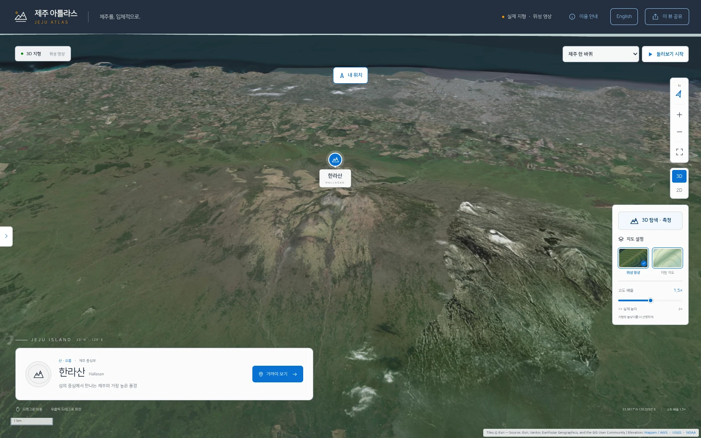
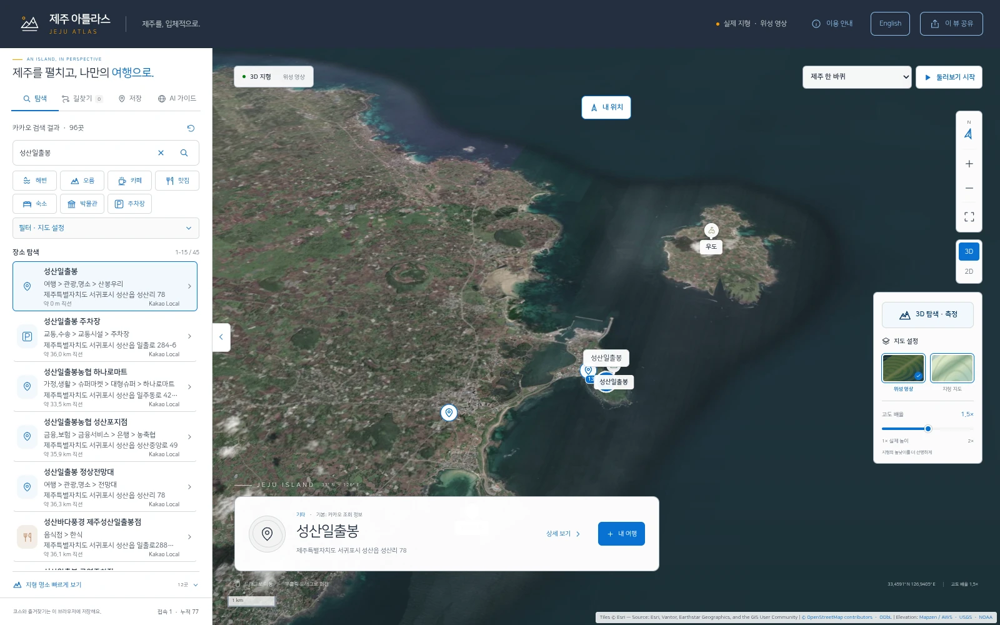
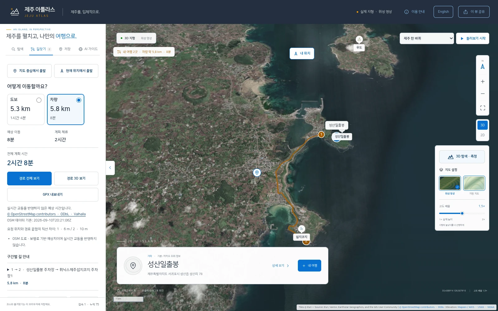
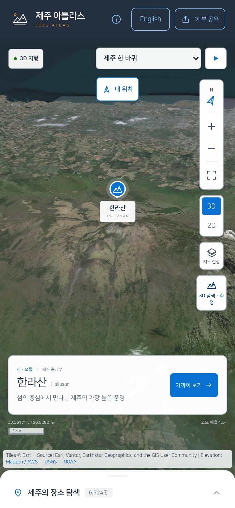
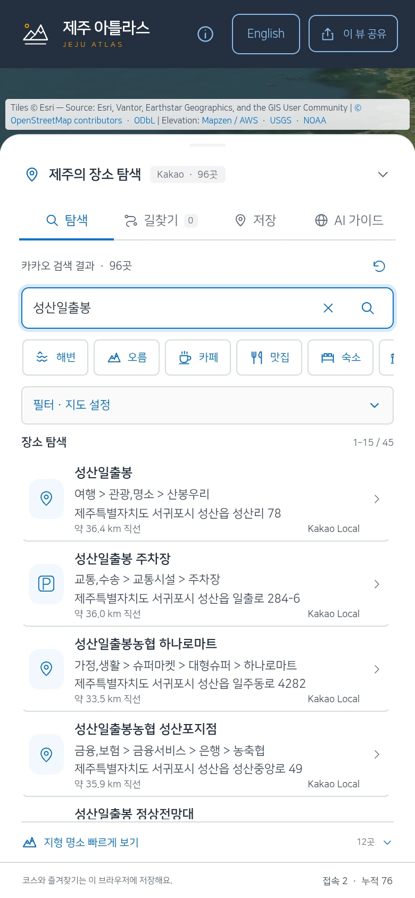
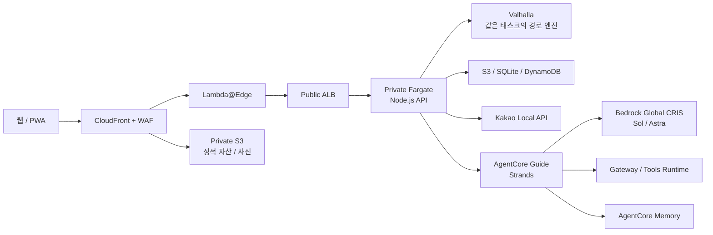

# 제주 아틀라스 | Jeju Atlas

[](package.json)
[](docs/architecture.md)
[](agent/README.md)
[](workshop/README.md)

[한국어](README.md) | [English](README.en.md)

제주의 실제 고도와 위성 지도에서 장소를 찾고, 여행 코스를 만들고, AI 가이드에게 질문하는 웹/PWA 서비스입니다.
지도 표현은 MapLibre, 장소 검색은 카카오 Local, 실제 도보와 차량 경로는 Valhalla가 담당합니다.

[서비스 열기](https://jeju-atlas.whchoi.net/) | [100~120분 워크숍](https://jeju-atlas.whchoi.net/workshop/) | [문서](docs/README.md) | [변경 이력](CHANGELOG.md)



*앱 화면은 2026-09-13 운영 서비스의 한국어 UI를 캡처했습니다.*

## 개요

TypeScript와 Vite로 만든 화면을 Node.js API 서버와 연결합니다.
AWS에서는 CloudFront, WAF, Public ALB와 Private ECS Fargate를 사용하며 기존 VPC와 NAT Gateway를 재사용합니다.
AI 가이드는 전용 Bedrock AgentCore Runtime에서 Strands로 실행합니다.

전체 앱 검증 배포는 `release-20260912T153512Z`, 당시 ECS 태스크 정의는 `jeju-3d:26`입니다.
2026-09-12에 태스크 2개와 ALB 대상의 정상 상태, 운영 검사 99개를 확인했습니다.
수치는 해당 배포의 기록이며 현재 상태 조회를 대신하지 않습니다.
[배포 기록](workshop/DEPLOYMENT.md)에서 확인 범위를 볼 수 있습니다.

2026-09-16에는 도구 사전 구성과 PyYAML 복구, 새 계정용 14장 프롬프트,
Codex 설정과 HUD 안내를 교재 전용 이미지로 `jeju-3d:30`에 반영했습니다.
태스크 2개와 ALB 대상, 공개 파일과 브라우저를 확인했으며 앱 릴리스와 라우팅 이미지는 유지했습니다.

2026-09-24에는 독립 EC2 랩의 소스 준비와 작업 위치, 선택 검증 및 HUD 안내를
교재 전용 이미지 `jeju-3d:31`에 반영했습니다. 설치 도구도 GitHub main에 게시했으며
공개 교재와 다운로드, 데스크톱과 모바일 동작을 확인했습니다.

## 주요 기능

| 영역 | 구현 내용 |
|---|---|
| 3D 지도 | 실제 고도, 위성 영상, 지형 음영, 2D/3D 전환, 높이 조절 |
| 장소 탐색 | 이름과 분류 검색, 지도 범위 검색, 목록과 지도 위치 연결 |
| 저장 | 즐겨찾기 검색과 분류, 최근 검색과 열람 기록, 자주 쓰는 장소 5곳 고정 |
| 여행 코스 | 출발과 도착 검색, 경유지와 체류시간, 전체 순서 뒤집기 |
| 실제 이동 경로 | Valhalla의 도보/차량 거리와 예상 시간, 구간 안내, GPX |
| AI 가이드 | 한국어/영어, 스트리밍 마크다운, 사용 도구 표시, 추천 질문 |
| 장소 상세 | 제공된 사진, 이용시간, 편의 정보, 출처와 조회 시각 |
| 둘러보기 | 제주 한 바퀴와 확보된 올레길 구간의 3D 재생 |
| PWA | 앱 설치, 저장한 코스와 앱 화면의 오프라인 열람 |
| 접속 집계 | 최근 90초의 접속 세션과 누적 최초 접속 세션 표시 |

기본 지도는 대표 지형 명소부터 표시합니다. 장소 마커는 선택한 검색 결과를 사용합니다.
카카오 조회는 한 번에 15건, 최대 45건이며 넓은 범위의 모든 장소를 한꺼번에 표시하지 않습니다.

## 실제 화면

### 장소 검색

성산일출봉 검색 결과와 선택한 장소를 지도에서 함께 확인하는 화면입니다.



### 도보·차량 경로 비교

같은 출발·도착 지점의 도보와 차량 이동 거리·예상 시간을 비교하고, 실제 도로 경로를 지도에 표시합니다.



### 모바일

390px 너비의 모바일 화면에서 3D 지도를 살펴보고, 아래 패널을 펼쳐 장소를 검색한 모습입니다.

| 3D 지도 | 장소 탐색 |
| :---: | :---: |
|  |  |

## 아키텍처



ALB는 CloudFront 원본 Prefix List와 검증 헤더를 확인합니다.
Fargate에는 Public IP를 할당하지 않습니다.
AgentCore Runtime은 IAM 인증을 사용하는 관리형 PUBLIC 네트워크 구성이며 Private Fargate와 구분합니다.
[전체 구성과 데이터 흐름](docs/architecture.md)을 참고하세요.

## 시작하기

Node 24 계열 24.18.1 이상, npm과 Python이 필요합니다.
Python 3.10 이상을 권장하며, AgentCore 워크숍 Runtime은 Python 3.12를 사용합니다.

```bash
git clone https://github.com/whchoi98/jeju-atlas.git
cd jeju-atlas
npm ci
mkdir -p .local
python3 workshop/scripts/catalog_seed.py --output .local/catalog-standalone.sqlite
npm run build

HOST=127.0.0.1 PORT=8097 NODE_ENV=development \
PUBLIC_ORIGIN=http://localhost:8097 \
CATALOG_LOCAL_PATH="$PWD/.local/catalog-standalone.sqlite" \
node server/server.mjs
```

브라우저에서 `http://localhost:8097`을 엽니다. 원격 EC2에서는 해당 포트를 로컬로 전달합니다.
이 경로는 Git에 포함된 137개 시드로 화면을 확인하는 로컬 실행입니다.
카탈로그 생성기는 기존 파일을 덮어쓰지 않으므로 재실행할 때는 생성 단계를 건너뜁니다.

AI, 카카오 조회와 실제 경로는 별도 Runtime, 키와 경로 엔진 설정이 있어야 사용할 수 있습니다.
운영 카탈로그, 공식 API 응답과 경로 그래프는 Git에 포함되지 않습니다.

Vite 개발 화면을 사용할 때는 두 터미널에서 실행합니다.
`.env.example`의 기본 `PUBLIC_ORIGIN`은 `http://localhost:5173`입니다.

```bash
cp .env.example .env
# 터미널 1
node --env-file=.env server/server.mjs
# 터미널 2
npm run dev
```

Python 검사 환경, 포트 설정과 카탈로그 확인은
[로컬 개발 안내](docs/onboarding.md)에 정리했습니다.

## 100~120분 AgentCore CLI 워크숍

EC2 사전 준비 후 **구현 프롬프트와 배포 프롬프트 두 개**로 제주 검색 도구와
참가자 AgentCore Runtime을 만듭니다. AgentCore CLI가 생성, 로컬 실행, 배포와 호출을
맡고 Codex, Claude Code, Kiro CLI 중 하나가 구현과 오류 수정을 수행합니다.

사전 구성과 01장 키 입력 뒤에는 03~08장의 하단 프롬프트를 한 장씩 사용하는 방식으로 진행할 수 있습니다.
본문 명령과 프롬프트를 중복 실행할 필요는 없으며, 이미 완료한 작업은 유지합니다.
05~08장은 추가 시간의 선택 심화 과정입니다.
[프롬프트 진행 안내](workshop/chapters/00-orientation.md#하단-프롬프트로-진행하는-방법)를 참고하세요.

[사전 구성](workshop/reference/preconfiguration.md)에서 Node 24, uv와 Python 3.12,
Docker, 사용자 npm 경로의 `@aws/agentcore` 0.28.1, AWS 역할과 선택한 Agentic AI 코딩 어시스턴트를 준비합니다.
`check_env.sh`로 점검하고 `start.sh`로 참가자 환경과 누락 core 도구를 준비합니다.
전체 Git 소스가 필요하며 읽기용 교재 ZIP에는 실행 스크립트가 없습니다.

Bedrock 단기 또는 장기 API 키는 본인 터미널의 `workshop_env.py configure`에서 숨김 입력합니다.
API 키와 모델 호출 리전을 참가자 `.env`에 보관하고, 배포 시에는 SSM ARN으로 연결합니다.
06장의 심화 Guide도 `lab.py agent-key`로 처음 입력한 같은 키를 사용합니다.
기존 Guide에는 코드와 Runtime 설정 변경을 배포하며 Gateway와 Memory는 IAM 인증을 유지합니다.
카카오, 관광공사 TourAPI와 VISIT JEJU 키는 **첫 배포 후 선택 입력**합니다.
AWS 배포에는 EC2 IAM 역할을 계속 사용합니다.
[키와 연동 안내](workshop/reference/keys-and-integrations.md)에 실제 반영과 갱신 절차가 있습니다.

Claude Code는 `claude --permission-mode auto`, Codex는
`--sandbox workspace-write -a on-request -c 'approvals_reviewer="auto_review"'`를 권장합니다.
각 CLI의 로그인과 지원 모델은 사전에 확인합니다. JejuGuide Runtime의 Sonnet 4.6과
코딩 도구의 모델을 구분합니다. [Agentic AI 코딩 어시스턴트 환경](workshop/reference/ai-cli-environments.md)을 참고하세요.

| 구분 | 구성 |
|---|---|
| 사전 준비 | EC2 도구 설치, 로그인, CDK bootstrap과 권한 확인, 수업 시간 밖 |
| 본 실습 | 00~04장, 100분 |
| 여유 시간 | 최대 20분, 전체 120분 |
| 심화 자료 | 05~14장, 전체 앱과 AWS 인프라, 추가 시간 |
| 결과물 | 실제 모델과 제주 검색 도구를 사용하는 참가자 전용 Runtime |
| 교재 | Markdown, HTML, 다운로드 ZIP과 오프라인 PWA |

참가자별 독립 랩에서는 `team01`과 `AtlasCliTeam01`을 공통 내부 식별자로 자동 사용합니다.
팀명 선택과 치환은 필요하지 않습니다. 별도 종합 검증과 HUD 설치는 기본 진행에서 생략하고,
오류가 있거나 필요한 경우에만 해당 진단을 선택합니다. 터미널 블록은 첫 `cd`로 작업 위치를 맞춥니다.

시간은 수업 편성 기준이며 실제 계정의 배포 리허설 완료를 뜻하지 않습니다.
기본 CLI Runtime과 전체 앱의 Guide/Tools/Gateway/Memory는 별도 배포입니다.
심화 앱은 참가자 App 스택의 기본 CloudFront HTTPS URL을 사용합니다.
ACM, DNS와 사용자 도메인 준비는 실습에 포함하지 않습니다.

[설치 스킬](skills/jeju-atlas-install/SKILL.md)은 준비와 중단 작업 재개를 지원합니다.
[14장 통합 프롬프트](workshop/prompts/14-project-completion.md)의 전체 앱 완성은 선택 과정이며,
45분은 범위 정리와 첫 수정 검사 시간입니다. Codex Bedrock provider와 HUD도 선택 준비입니다.
Claude Code 사용자는 [사전 설치](workshop/reference/preconfiguration.md#선택-claude-code-hud와-플러그인)에서
선택 HUD와 AWS 및 기타 플러그인을 준비할 수 있습니다.


셸 명령은 터미널 창에, 공통 프롬프트는 선택한 Agentic AI 코딩 어시스턴트 대화창에 붙여 넣습니다.


[실습 안내](workshop/README.md) | [진행자 준비](workshop/reference/facilitator.md) | [다운로드 안내](workshop/reference/offline-start.md)

## 환경 설정

| 설정 | 용도 |
|---|---|
| `CATALOG_LOCAL_PATH` 또는 `CATALOG_BUCKET` | 로컬 SQLite 또는 소유 S3 카탈로그 |
| `DETAILS_BUCKET` | 공식 상세 스냅샷 |
| `PUBLIC_ORIGIN` | 브라우저에서 사용하는 실제 앱 origin |
| `ROUTING_URL` | 같은 태스크 또는 로컬 환경의 Valhalla |
| `ROUTING_DATA_UPDATED_AT` | 실제 경로 데이터의 기준 시각 |
| `KAKAO_REST_API_KEY` | 서버 전용 카카오 조회 키. 운영에서는 SSM 주입 |
| `GuideLimitsEnabled` | 운영 템플릿의 AI 한도 사용 여부 |

모든 운영 설정은 [배포 절차](docs/runbooks/deploy.md)와 [.env.example](.env.example)을 함께 확인합니다.
운영 스크립트는 소유 계정과 서울 리전에 고정되어 있습니다.
다른 계정에는 원본 운영 배포기를 바로 실행하지 말고 워크숍의 참가자별 절차를 사용합니다.

## 데이터 범위

- Git의 137개 장소 파일은 실습용 시드입니다. 기본 좌표, 주소와 소개의 정확성을 공식 검증한 자료가 아닙니다.
- 운영의 6,724건은 별도 카탈로그 스냅샷입니다. 카카오 전체 장소 수와 같지 않습니다.
- 공식 보강은 해당 항목의 근거입니다. 일부 필드의 매칭을 장소 전체 검증으로 해석하지 않습니다.
- 실시간 교통, 카카오 평점과 리뷰 전체를 제공한다고 가정하지 않습니다.
- 새 지도 타일, 장소 조회, 날씨와 AI 답변은 온라인 기능입니다.

[데이터 품질](docs/data-quality.md) | [공식 상세와 올레길](docs/official-details-olle.md)

## 프로젝트 구조

```text
jeju-atlas/
├── src/                 # 지도와 사용자 화면
├── server/              # Node.js API
├── shared/              # 클라이언트/서버 계약
├── public/              # 정적 자산, 글꼴과 출처
├── agent/guide/         # Strands Guide
├── agent/tools/         # MCP Tools
├── routing/             # Valhalla 실행과 검증
├── infra/               # CloudFormation
├── scripts/             # 빌드, 배포와 운영 검사
├── tests/               # 앱과 인프라 회귀 검사
├── workshop/            # 100~120분 교재와 심화 자료
├── docs/                # 아키텍처, API와 운영 절차
├── AGENTS.md            # 저장소 작업 지침
├── CHANGELOG.md
├── CONTRIBUTING.md
└── SECURITY.md
```

## 검사

```bash
npm run check
npm run workshop:check
# Playwright와 Chromium을 준비한 환경에서 추가 실행
WORKSHOP_BROWSER_TEST=1 npm run workshop:check
```

전체 검사에는 boto3, requests와 cfn-lint도 필요합니다.
실제 배포, 모델 호출과 공개 서비스 검사는 별도이며 로컬 통과로 대신하지 않습니다.
[기여 안내](CONTRIBUTING.md)에 검사 범위와 변경 기록 작성 방법이 있습니다.

## 문서와 문의

[문서 목록](docs/README.md) | [구현 참조](docs/reference/INDEX.md) | [API](docs/api-reference.md) | [배포](docs/runbooks/deploy.md) | [복구](docs/runbooks/rollback.md) | [보안](SECURITY.md)

- 유지관리: [@whchoi98](https://github.com/whchoi98)
- 일반 문의와 버그: [GitHub Issues](https://github.com/whchoi98/jeju-atlas/issues)
- 민감한 정보가 포함된 보고: [보안 보고 안내](SECURITY.md)

루트 코드 라이선스 파일은 아직 선언되어 있지 않습니다.
데이터, 사진, 지도, 폰트와 이모지는 각각의 출처와 이용 조건을 확인해야 합니다.
[폰트](public/fonts/README.md), [이모지](public/emoji/README.md), [Agent 출처](agent/source-provenance.json)를 참고하세요.
