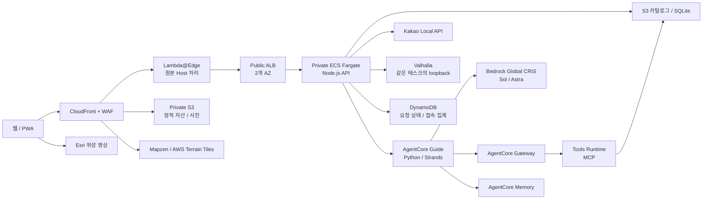

# 아키텍처와 데이터 흐름

이 문서는 저장소의 구현과 2026-09-12 검증 배포를 기준으로 설명합니다.
실제 서비스 상태와 리소스 값은 배포 시 다시 확인합니다.

## 요청 경로

CloudFront는 정적 자산과 사진을 S3 OAC로 읽고 고도 타일을 별도 원본에서 캐시합니다.
브라우저는 MapLibre와 WebGL로 지도를 렌더링합니다. Fargate가 GPU 렌더링을 수행하는 구조는 아닙니다.
동적 API 요청은 ALB를 거쳐 Node.js 서버로 전달합니다.

## 로컬 실행과 소스 경계

`index.html`은 `src/main.ts`를 불러오고 지도 초기화와 각 화면 기능을 연결합니다.
MapLibre worker는 `src/map.ts`에서 별도로 번들에 포함해 해시가 붙은 빌드에서도
읽을 수 있도록 합니다. 공유 요청·응답 타입은 `shared/`에서 관리합니다.

개발 중 Vite는 `/api`를 `127.0.0.1:8097`의 별도 Node.js 서버로 전달합니다.
`server/server.mjs`는 기본적으로 `dist/`를 정적 루트로 사용하며, 카탈로그,
Guide Runtime 또는 라우팅 설정이 있을 때 `server/api.mjs`를 초기화합니다.
카탈로그는 `server/catalog.mjs`에서 읽기 전용 SQLite 스냅샷으로 엽니다.
따라서 새 clone에서는 시드 생성과 빌드가 API 시작보다 먼저 필요합니다.

[온보딩](onboarding.md)에 두 프로세스의 실행 순서와 origin 설정을,
[구현 참조 색인](reference/INDEX.md)에 계층별 코드와 기존 설계 기록을 정리했습니다.

## 실행 자원

| 구분 | 역할과 경계 |
|---|---|
| 네트워크 | 기존 `cc-on-bedrock-vpc`, 서브넷, 라우트와 NAT 재사용 |
| ALB | Public Subnet, CloudFront 원본 Prefix List와 검증 헤더 확인 |
| Fargate | Private Subnet, Public IP 없음, ARM64, 웹과 라우팅 컨테이너 |
| Guide Runtime | IAM 인증, Python과 Strands, 관리형 PUBLIC 네트워크 |
| Tools Runtime | 별도 MCP 서버, 전용 Gateway 대상 |
| Memory | 사실, 선호, 요약과 경험 전략 |
| 이미지 | ECR의 불변 태그와 digest, 취약점 검사 |
| 관측 | CloudWatch, OpenTelemetry, SNS 알림 토픽 |

2026-09-12 확인 구성은 Fargate 2개, 태스크당 0.5 vCPU와 1 GiB, 자동 확장 2~4개입니다.
이는 검증 당시 구성입니다. 운영 설정은 `infra/production.json`과 실제 AWS 상태를 대조합니다.

## AI 요청

브라우저는 서명 세션과 요청 증명을 사용하고, 웹 서버는 IAM 역할로 Guide Runtime을 호출합니다.
Guide는 Strands의 도구 실행과 스트리밍을 사용합니다.
일반 질문은 `global.openai.gpt-5.6-sol`, 일정 계획은 `global.openai.gpt-6-astra`로 구성되어 있습니다.
모델 ID와 접근 권한, 실제 호출 성공은 별도로 확인합니다.

Guide와 Tools는 전용 코드, Gateway, Memory와 S3를 사용합니다.
HTTP Gateway의 실제 대상 경로는 해당 배포 출력에서 읽습니다.
모든 Gateway를 같은 `/mcp` 경로로 추정하지 않습니다.
[전용 AgentCore 설명](agentcore-components.md)에 세부 구성이 있습니다.

웹의 도보/차량 비교는 Valhalla 실제 도로 경로를 사용합니다.
Guide의 `route`/`plan_day` 도구는 별도의 구현이며 제공처 설정에 따라 참고용 fallback을 반환할 수 있습니다.
두 결과를 동일한 실제 도로 계산으로 설명하지 않습니다.

## 데이터

| 자료 | 저장과 처리 |
|---|---|
| 원본 시드 | Git의 137개 실습 자료. 기본 정보는 미검증 |
| 운영 카탈로그 | 별도 S3 SQLite 스냅샷을 웹과 Tools에서 읽음 |
| 카카오 결과 | 이름/분류/범위별 조회. 15건씩 최대 45건 |
| 공식 상세 | TourAPI와 VISIT JEJU 스냅샷, 항목별 출처와 시각 |
| 사진 | 허용된 제공처 자료와 출처를 유지해 별도 media 경로로 제공 |
| 브라우저 자료 | 즐겨찾기, 코스와 제한된 탐색 기록 |
| 요청과 집계 | DynamoDB의 요청 ID/대화 조정, 현재/누적 접속 수 |

카탈로그 조회 시각, 제공처 갱신 시각과 독립 검토 여부를 구분합니다.
메모리 이벤트 보관과 브라우저 데이터 삭제도 서로 다른 범위입니다.

## 워크숍

EC2 설치는 수업 전에 끝내고 본 실습은 구현과 배포 프롬프트 두 개로 진행합니다.
기본 JejuGuide는 Python 3.12와 Bedrock 단기키를 사용합니다. 키는 참가자 `.env`에서
로컬 실행에 전달하며, 원격 Runtime은 소유 SSM ARN과 단일 파라미터 읽기 정책을 사용합니다.
AWS 배포와 Runtime inbound 호출에는 IAM을 유지합니다.
[키와 선택 연동](../workshop/reference/keys-and-integrations.md)을 참고하세요.

본 실습은 준비된 EC2에서 AgentCore CLI로 참가자 전용 Runtime 하나를 만드는 100~120분 과정입니다.
전체 웹, Gateway, Memory, 데이터 수집과 운영 구성을 만드는 05~13장은 심화 자료입니다.
[14장](../workshop/chapters/14-project-completion.md)은 통합 프롬프트로 기존 구현의
남은 작업을 정하고 코드, IaC와 실제 서비스의 검증 범위를 연결하는 선택 가이드입니다.
워크숍 화면과 원본 지도 앱은 PWA의 설치 범위와 캐시를 분리합니다.

## 구현 위치

프런트엔드는 `src/`, 웹 API는 `server/`, Agent는 `agent/`, 라우팅은 `routing/`에 있습니다.
인프라는 `infra/`, 배포와 검증은 `scripts/`에서 관리합니다.
[자원 전체 매핑](../workshop/reference/resources.md)과 [배포 절차](runbooks/deploy.md)를 참고하세요.
